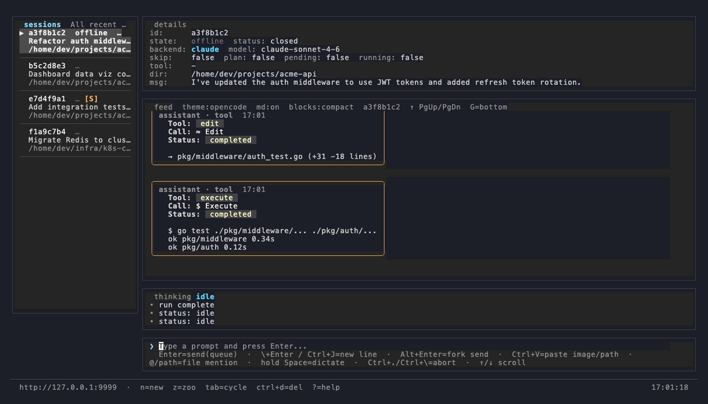

# orbitor

**Stop babysitting your AI coding sessions.**

You kick off a task in Claude Code or GitHub Copilot, then sit there watching it work — waiting to approve a file write, answer a clarifying question, or just see if it finished. Orbitor lets you walk away. Start sessions on your dev machine, manage them from a rich terminal UI, and check in from your phone when you're at lunch, on the couch, or in a meeting.

- **Run multiple sessions at once** — different projects, different models, side by side
- **Approve permissions from your phone** — no need to context-switch back to the terminal
- **Get notified when sessions finish** — or when they need your input
- **Fork a session** to explore a different approach without losing your place
- **Dictate prompts** with push-to-talk — talk to your code while your hands are busy
- **Works with Claude Code and GitHub Copilot** — use whichever fits the task

## Screenshots



---

## Quick Start

```bash
brew tap will-osborne/orbitor
brew install orbitor
orbitor setup
orbitor
```

`orbitor setup` detects your Tailscale IP, writes the config, and optionally installs a background service. Then `orbitor` opens the TUI — press `Ctrl+N` to create your first session.

---

## Prerequisites

- macOS or Linux
- At least one AI coding CLI, already authenticated:
  - [`claude`](https://docs.anthropic.com/en/docs/claude-code) (Claude Code)
  - [`gh copilot`](https://docs.github.com/en/copilot/github-copilot-in-the-cli) (GitHub Copilot)
- [Tailscale](https://tailscale.com) — recommended for mobile access and remote connections
- Go 1.22+ (only if building from source)

---

## Installation

### Homebrew (recommended)

```bash
brew tap will-osborne/orbitor
brew install orbitor
```

### Build from source

```bash
git clone https://github.com/will-osborne/orbitor
cd orbitor
go build -o orbitor .
./orbitor setup
```

---

## Usage

| Command | Description |
|---|---|
| `orbitor` | Open the TUI (default) |
| `orbitor new` | Create a session in the current directory and attach |
| `orbitor new claude claude-sonnet-4-6` | Create a session with a specific backend and model |
| `orbitor server` | Run the HTTP server in the foreground |
| `orbitor setup` | Interactive setup wizard |
| `orbitor service install` | Install as a background login service |

---

## Mobile App

Monitor sessions, send prompts, and approve permissions from your phone.

1. Install the app *(link TBD)*
2. Enter your server address (e.g. `http://100.x.x.x:8080`)
3. Tap a session to open the chat — tap the permission banner to approve or deny

Push notifications fire when a session completes or needs your attention.

---

## Remote Access with Tailscale

Tailscale gives you secure peer-to-peer connectivity between your server, phone, and teammates — no port forwarding required.

1. Install [Tailscale](https://tailscale.com/download) on both the server and your phone
2. Sign in with the same account
3. Run `orbitor setup` — it auto-detects your Tailscale IP

A teammate can connect to your running server from their own machine:

```bash
brew tap will-osborne/orbitor && brew install orbitor
orbitor setup    # enter the server machine's Tailscale IP
orbitor          # opens TUI pointed at your server
```

---

## Configuration

`~/.orbitor/config.json` — generated by `orbitor setup`, or create manually:

```json
{
  "serverURL": "http://100.x.x.x:8080",
  "listenAddr": "100.x.x.x:8080",
  "defaultBackend": "claude",
  "defaultModel": "claude-sonnet-4-6",
  "skipPermissions": false,
  "planMode": false
}
```

| Field | Description |
|---|---|
| `serverURL` | URL the TUI connects to. `http://127.0.0.1:8080` for local, or Tailscale IP for remote. |
| `listenAddr` | Address the server binds to. Set to Tailscale IP to allow remote clients. |
| `defaultBackend` | `"claude"` or `"copilot"` |
| `defaultModel` | Model passed to the backend (e.g. `claude-sonnet-4-6`, `gpt-4o`) |
| `skipPermissions` | Auto-approve all permission prompts |
| `planMode` | Start sessions in plan mode |

---

## TUI Key Bindings

| Key | Action |
|---|---|
| `Enter` | Connect to session / send prompt |
| `Shift+Enter` | Insert newline |
| `Alt+Enter` | Fork: clone session and send prompt to the clone |
| `Tab` / `Shift+Tab` | Cycle sessions |
| `↑` / `↓` | Scroll chat |
| `Ctrl+↑` / `Ctrl+↓` | Prompt history |
| `Ctrl+N` | New session |
| `Ctrl+D` | Delete session |
| `Ctrl+V` | Paste image or file path |
| `Hold Space` | Push-to-talk dictation |
| `Ctrl+.` / `Ctrl+\` | Interrupt current run |
| `Ctrl+P` | Command palette |
| `Ctrl+T` | Cycle themes |
| `Alt+M` | Toggle mouse select mode (for copying text) |

### Slash Commands

| Command | Description |
|---|---|
| `/new <dir> [backend] [model]` | Create a new session |
| `/fork <prompt>` | Clone current session and send a prompt |
| `/use <id>` | Switch to a session by ID |
| `/interrupt` | Interrupt the current run |
| `/skip [true\|false]` | Toggle skip-permissions |
| `/help` | List all commands |

---

## Service Management

Run orbitor as a persistent background service that starts at login:

```bash
orbitor service install    # install and enable auto-start
orbitor service uninstall  # remove the service
orbitor service start      # start now
orbitor service stop       # stop
orbitor service restart    # restart
orbitor service status     # check if running
orbitor service logs       # tail logs
```

Or via Homebrew:

```bash
brew services start orbitor
brew services stop orbitor
```

---

## How It Works

Orbitor runs a lightweight HTTP/WebSocket server that spawns and manages AI assistant processes. Each session gets its own working directory, backend process, and message history persisted to a local SQLite database.

- **Real-time streaming** — TUI and mobile clients connect via WebSocket
- **Session persistence** — sessions survive server restarts and binary upgrades
- **Zero-downtime upgrades** — via [tableflip](https://github.com/cloudflare/tableflip); `brew upgrade` automatically restarts the service
- **Push notifications** — Firebase Cloud Messaging with optional local LLM summarizer

---

## License

*License TBD.*
